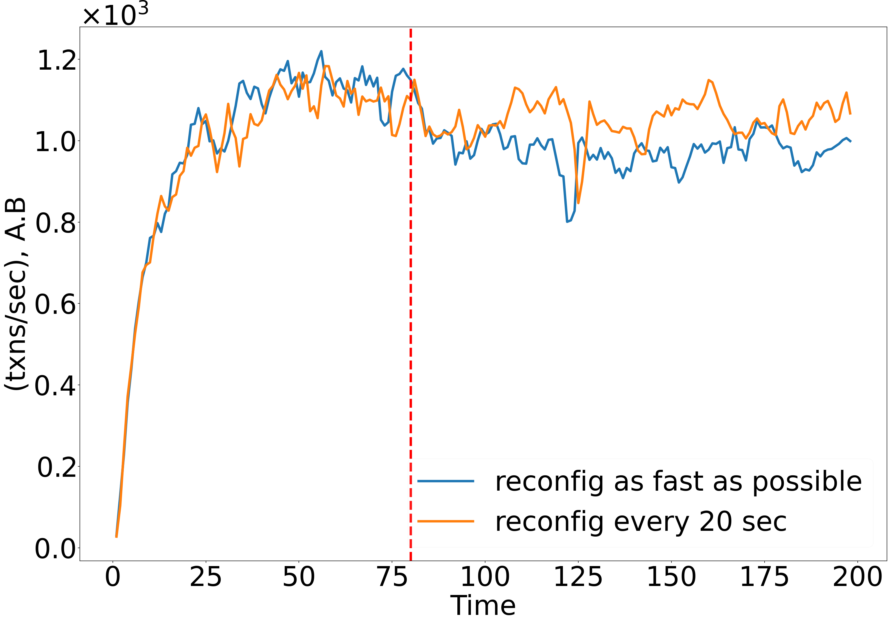
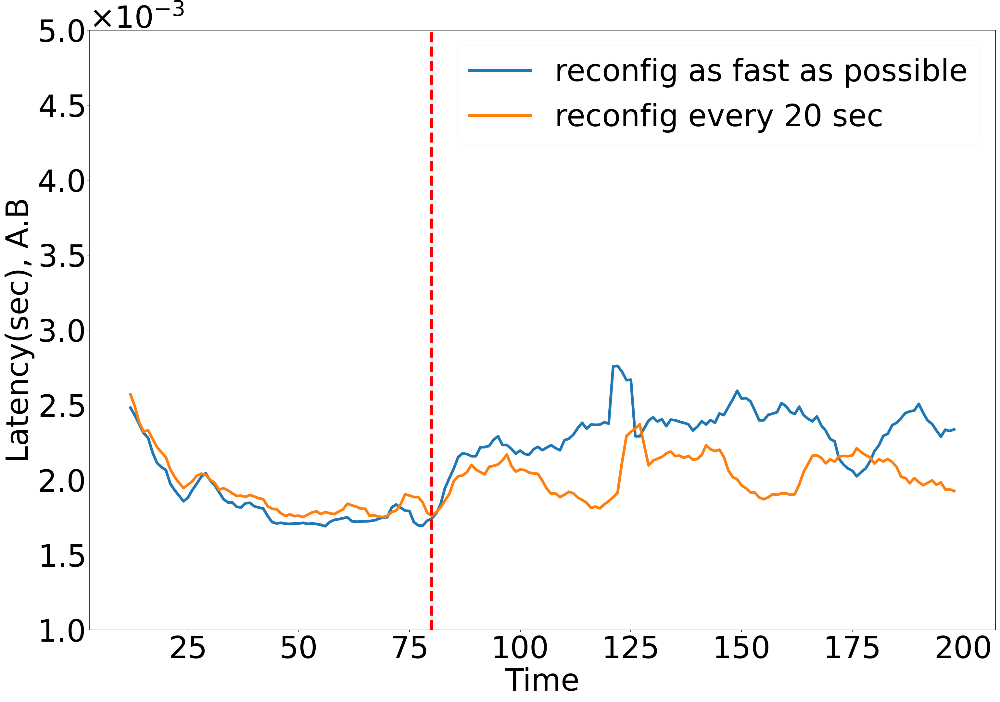
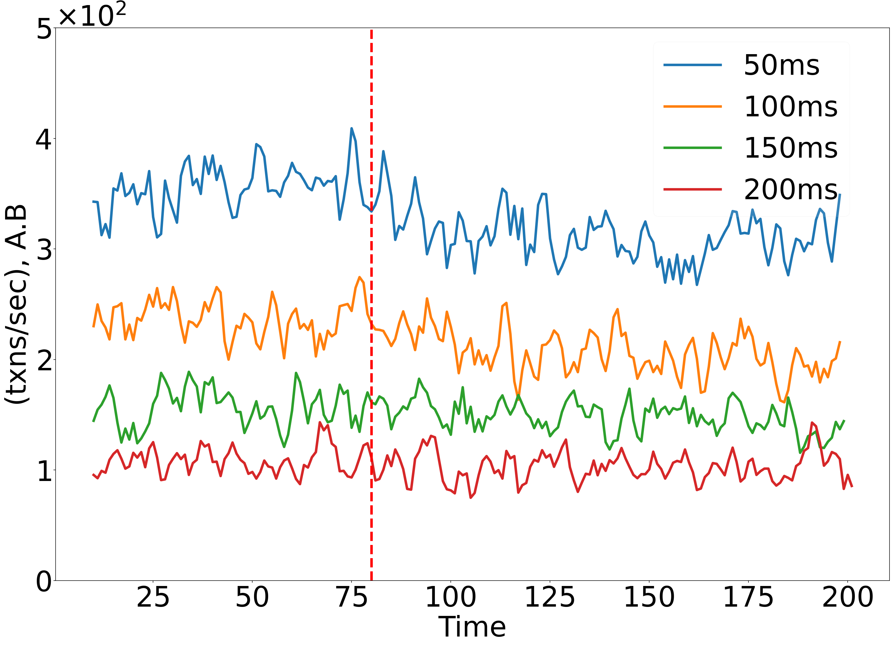
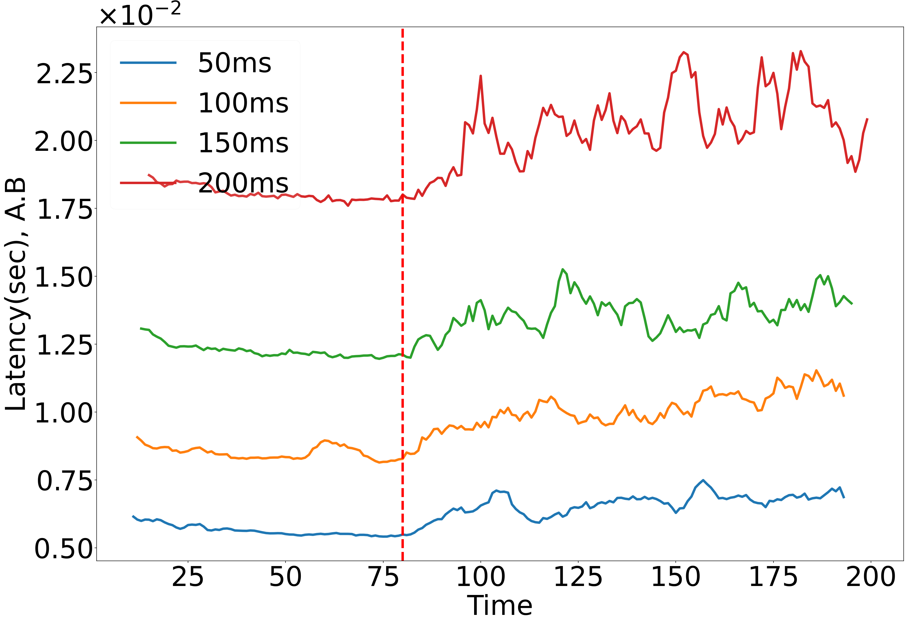

### Installation Instructions:

#### Required Libraries:

apt-get update
sudo apt install default-jre
apt-get -y install build-essential

apt-get -y install curl

curl -s "https://get.sdkman.io" | bash

sdk install gradle 7.4.2
apt-get -y install ant
apt-get -y install iputils-ping

#### To compile the code:
enter ava_bftsmart directory and type 
sudo ./gradlew installDist 

#### Sample notebooks for running a simulation with 2 clusters (each containing 4 nodes) and a client per cluster are as follows:

1) prepare_config.ipynb to generate the configuration files.
2) local_simulation.ipynb to run the simulation.

config/system.config contains editable parameters for the code. config/workloads/workload determines the workload for the code.

### Impact of reconfiguration frequency

Here, we illustrate the effect of the frequency of reconfigurations on the throughput and latency of Ava-Bftsmart. We experiment on a system with two clusters, where each has 10 replicas, and each has a client that issues transaction requests and another client that issues an increased load of reconfiguration requests. Reconfigurations begin at approximately 80 seconds. 
We experiment with two frequencies:
(1) once every 20 seconds, and
(2) continuously, without any delay between reconfiguration requests.

### Impact of Network Latency

Here, we experiment on a system with two clusters where each has 10 replicas, and each has a client that issues reconfiguration requests. We fixed one cluster at us-west1-b, and experimented with several locations for the second cluster: us-east5-c, asia-northeast1-b, europe-west3-c, and asia-south1-c, with latencies of 52ms, 91ms, 142ms, and 219ms to the first cluster, respectively. 

